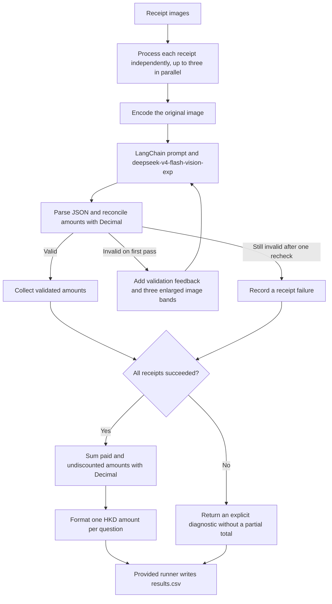

# FTEC5660 Homework 1: Receipt Chain

Build a LangChain pipeline that reads every supermarket receipt in a folder
with the vision-capable DeepSeek Flash model and answers these two questions:

1. How much money did I spend in total for these bills?
2. How much would I have had to pay without the discount?

For this homework, **amount spent** means the final payment after the receipt's
rounding line. **Without the discount** means the sum of the original positive
item prices: add back every promotion, coupon, member, app, packaging-damage,
and percentage discount, but do not add back rounding.

## Student task

Only edit the two functions in `hw1.py` that contain `### YOUR CODE HERE`:

- `build_chain()` creates your LangChain chain.
- `answer_queries()` runs the chain on the receipt images and returns one final
  response for each question.

You may use prompt chaining, routing, parallel calls, reflection, or a
combination. Your final responses should each contain one HKD amount. Do not
hard-code filenames or public answers; grading uses unseen receipt folders.

## Setup and public test

```bash
python3 -m venv .venv
source .venv/bin/activate
pip install -r requirements.txt
```

Put your DeepSeek key after `DEEPSEEK_API_KEY=` in `.env`, then run:

```bash
python3 hw1.py --image-folder public_test
```

The program creates `results.csv` in the current directory. Its columns are
`query`, `model_response`, and `correctness`. The public answers are in
`public_test/ground_truth.json`. The starter intentionally returns the dummy
response `please design your chain to answer these two queries.` so it runs
before you add any API code.

The required model is `deepseek-v4-flash-vision-exp`, the vision-capable
DeepSeek Flash model. JPEG, PNG, GIF, and WebP inputs are accepted by the
homework runner.


## Homework 1 solution: 



My solution separates visual extraction from exact arithmetic. In `build_chain()`, a LangChain `ChatPromptTemplate | ChatDeepSeek | StrOutputParser` pipeline uses the required `deepseek-v4-flash-vision-exp` model to transcribe each receipt into JSON containing original item line totals, every discount, the subtotal, signed rounding and the final payment. A `RunnableLambda` parses and validates the ledger using Python `Decimal`, checking that item totals minus discounts equal the printed subtotal and that any extracted final payment equals subtotal plus rounding. The prompt distinguishes line totals from unit prices and quantities, preserves repeated and stacked discounts, and excludes change, card balances and rounding from discounts. If the first transcription is malformed, uncertain or inconsistent, the same model rechecks the original image with validation feedback and three overlapping enlarged views generated by Pillow, with at most one visual recheck. In `answer_queries()`, receipts are processed in parallel with a maximum concurrency of three; Python then sums subtotal plus rounding for Question 1 and subtotal plus the absolute discount amounts for Question 2, returning exactly one `HK$` amount with two decimal places per question. Unresolved failures produce an explicit diagnostic rather than a fabricated or partial total; such responses are not valid numerical answers. Only the two designated functions are modified, and the solution does not use filenames or ground-truth answers to infer amounts. Arithmetic checks help detect transcription errors but cannot guarantee correct recognition of every receipt.

## Task 2: Reflection

**Written on 25 September 2026. Event window: 16–25 September 2026.**

Over the past ten days, two AI news stories have made me think more carefully
about my future career. I am interested in developing AI applications, and
these events helped me see which skills I should focus on.

On **18 September**, Anthropic announced a partnership with Accenture to
independently evaluate AI models. This reminded me that even a powerful model
needs careful testing. An answer can sound convincing and still be wrong.
For my future work, I want to learn how to check AI outputs and understand
common mistakes. I now see testing as an important part of building an AI
application. [Source](https://www.anthropic.com/news/accenture-embedded-evaluation)

On **22 September**, Anthropic released Claude Opus 5.5. According to the
company, it offers better performance and lower running costs than Opus 5.
This makes me more interested in building useful tools with existing models.
Lower costs could make it easier for students and small teams to try their
ideas. However, I would still test a model on my own task before choosing it.
[Source](https://www.anthropic.com/claude-opus-5-5)

My next step is to improve my Python and data analysis skills and learn more
about using model APIs. I would like to build a simple document-summary tool
and check its summaries against the original text. These events have made my
career plan more practical: learn the basics, build small projects, and use
testing to find what needs improvement.

*Prepared with AI assistance.*
